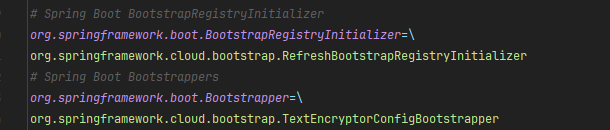

# 启动类分析

```java
public class SpringbootApplication {
    public ConfigurableApplicationContext run(String... args) {
        StopWatch stopWatch = new StopWatch();
        stopWatch.start();
        // 创建BootstrapContext对象
        // 并通过BootstrapRegistryInitializer向其中注入自定义逻辑,以供Spring Boot启动阶段使用。
        // 它为扩展和定制Spring Boot的启动提供了可插拔的方式。
        DefaultBootstrapContext bootstrapContext = createBootstrapContext();
        ConfigurableApplicationContext context = null;
        // 配置headless
        // 这主要影响到 Java 的 AWT 和 Swing UIs。
        configureHeadlessProperty();
        // 获取应用程序运行监听器
        // getSpringFactoriesInstances(SpringApplicationRunListener.class, types, this, args)这个方法会查找所有可用的SpringApplicationRunListener实例。
        // 这些实例是通过 Spring 的SpringFactoriesLoader从META-INF/spring.factories文件中加载的。每个实例都会使用SpringApplication和args` 作为构造函数参数进行实例化。
        SpringApplicationRunListeners listeners = getRunListeners(args);
        // 监听器------>starting 正在启动
        listeners.starting(bootstrapContext, this.mainApplicationClass);
        try {
            // 创建应用参数
            ApplicationArguments applicationArguments = new DefaultApplicationArguments(args);
            // 准备环境
            ConfigurableEnvironment environment = prepareEnvironment(listeners, bootstrapContext, applicationArguments);
            // 忽略 beanInfo（设置系统属性）
            configureIgnoreBeanInfo(environment);
            // 打印 banner。
            Banner printedBanner = printBanner(environment);
            // 创建应用上下文
            context = createApplicationContext();
            context.setApplicationStartup(this.applicationStartup);
            // 准备上下文
            prepareContext(bootstrapContext, context, environment, listeners, applicationArguments, printedBanner);
            // 刷新上下文
            refreshContext(context);
            // 刷新后处理
            afterRefresh(context, applicationArguments);
            // 停止计时器
            stopWatch.stop();
            if (this.logStartupInfo) {
                new StartupInfoLogger(this.mainApplicationClass).logStarted(getApplicationLog(), stopWatch);
            }
            // 监听器------>started 已经启动
            listeners.started(context);
            callRunners(context, applicationArguments);
        }
        catch (Throwable ex) {
            handleRunFailure(context, ex, listeners);
            throw new IllegalStateException(ex);
        }

        try {
            listeners.running(context);
        }
        catch (Throwable ex) {
            handleRunFailure(context, ex, null);
            throw new IllegalStateException(ex);
        }
        return context;
    }
}
```

## DefaultBootstrapContext

类的实例缓存，提供通过类型获取实例的方法。核心接口是 `BootstrapRegistry`，它提供了注册和获取实例的方法。

### BootstrapRegistry
在 Spring Boot 2.4.0 版本中，Spring 团队引入了一个新的接口，名为 BootstrapRegistry。这个接口在 Spring 应用程序启动的早期阶段，
即 Spring ApplicationContext 创建之前，提供了一种注册和配置关键组件和基础设施的方式。
BootstrapRegistry 的主要职责包括：
提前注册关键的基础设施组件：这些组件在 Spring 应用程序的整个生命周期中都会被使用，包括但不限于 Environment、PropertySource、ResourceLoader 等。
提供一种方式来配置和初始化这些关键的基础设施组件：通过 BootstrapRegistry，开发者可以在 Spring ApplicationContext 创建之前，对这些组件进行自定义配置和初始化。
为 Spring 应用程序的启动过程提供更多的扩展点：开发者可以使用 BootstrapRegistry 来注册更多的自定义组件和操作，以满足特定的需求。
BootstrapRegistry 的引入，提高了 Spring 应用程序启动过程的灵活性，也使得开发者可以更好地控制和管理 Spring 应用程序的启动过程。

### SpringApplication 的 bootstrapRegistryInitializers 属性 在springboot中初始化

- 从 Spring Factories 中获取所有 Bootstrapper（lambda转化） 和 BootstrapRegistryInitializer（直接添加） 类型的实例，然后将这些实例转换或者直接添加。

在我的业务项目中，可以看到有 `TextEncryptorConfigBootstrapper`  和 `RefreshBootstrapRegistryInitializer` （二者都来自spring cloud）会在启动时
被添加到 bootstrapRegistryInitializers 中。
spring cloud 的 spring.factories 中有如下配置：


#### TextEncryptorConfigBootstrapper 的作用
TextEncryptorConfigBootstrapper使TextEncryptor可以通过配置方式初始化,并将其集成到BootstrapContext中,以便在属性配置和其他bean中使用。它简化了TextEncryptor的配置和依赖注入。

#### RefreshBootstrapRegistryInitializer 的作用
RefreshBootstrapRegistryInitializer是一个BootstrapRegistryInitializer，它将RefreshScope注册到BootstrapRegistry中。这样，RefreshScope就可以在SpringApplication启动过程中使用了。

> 顺带一提，在初始化 `SpringApplication` 的时候，除了会从 spring.factories 中读出 `BootstrapRegistryInitializer` 的实现类，
> 还会读出 `ApplicationContextInitializer` 的实现类以及 `ApplicationListener` 的实现类，这些实现类会在 `run` 方法中被调用。


## SpringApplicationRunListeners

SpringApplicationRunListeners 由从 spring.factories 中读出 `SpringApplicationRunListener` 的实现类组成（还会存储上 `SpringApplication` 启动参数）。主要用来处理启动动作各阶段的回调。

## ApplicationArguments

ApplicationArguments 是对启动参数的封装，为了便于访问启动参数，它的实现类是 DefaultApplicationArguments。它提供了获取启动参数的方法，例如：getNonOptionArgs()、getOptionNames()、getOptionValues()、getSourceArgs() 等。

## ConfigurableEnvironment

ConfigurableEnvironment 通过 `prepareEnvironment` 方法由 listeners、bootstrapContext、applicationArguments 三个参数初始化,
它是 Spring 的环境抽象，它继承了 Environment 接口，并在其基础上提供了一些额外的方法，
例如：setActiveProfiles()、setDefaultProfiles()、setConversionService()、setPlaceholderPrefix()、setPlaceholderSuffix() 等。

### prepareEnvironment 方法

prepareEnvironment 方法的主要作用是准备 ConfigurableEnvironment 实例，它的具体实现如下：
1. 创建一个适合的 Environment 实例。如果应用是一个 web 应用，那么就会创建一个 ConfigurableWebEnvironment 实例，否则创建一个 ConfigurableEnvironment 实例。
2. 配置 Environment 实例。这包括加载应用的配置文件（如 application.properties 或 application.yml），并将配置文件中的属性设置到 Environment 实例中。
3. 激活配置文件中定义的 profile。Profile 是 Spring 的一种特性，允许你为不同的环境（如开发环境、测试环境、生产环境等）定义不同的配置。
4. 触发 ApplicationEnvironmentPreparedEvent 事件。这个事件表示 Environment 已经准备好，可以被应用使用。
5. 将环境中的配置属性源附加到 `ConfigurationPropertySources` 环境中。
6. 如果 `DefaultPropertiesPropertySource` 环境中有默认属性源，将它移动到 `DefaultPropertiesPropertySource` 属性源列表的末尾，以保证默认属性的优先级低于其他属性源。
7. 返回准备好的 Environment 实例。

这个方法的主要目的是确保 Spring Boot 应用有一个正确配置的 Environment 实例，这个 Environment 实例将用于之后的应用启动流程，包括实例化 beans、配置 web 服务器等。